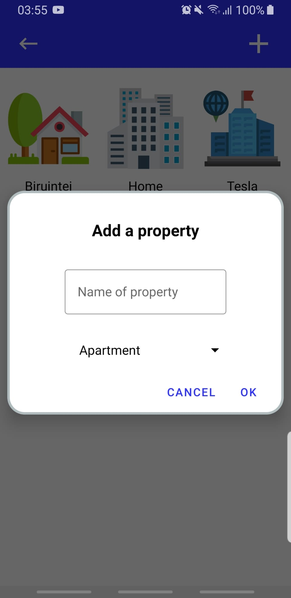

# Budget-Control-App
A mobile application developed in Android Studio with Java for frontend, PHP for backend and MySQL as a database. The program is designed to help with budget control regarding the cost of electrical bills. There are 4 main entities/classes (User, Property, Product, Report). Firstly, the user must register an account by passing through various validations, then he can create properties and products which belong to those properties and make customized reports that improve its budget management. Furthermore, the client can make rational decisions based on energy consumption charts and also graphs that represent the cost of electricity per month/date.  

Home Screen

User Validation

Adding a property

Products

Report - Energy Consumption Chart

Forecast of the next electrical bill

# TO RUN
In order to run, you must install Android Studio, XAMPP Control Panel, start Apache and MySQL and change the IpV4 Adress of the localhost into your adress

